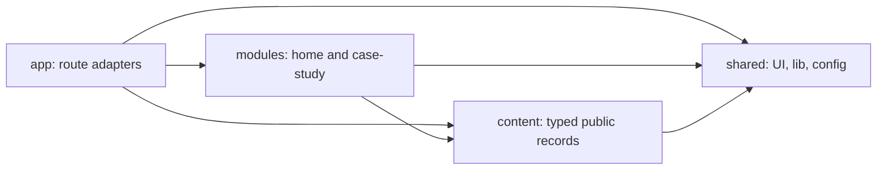
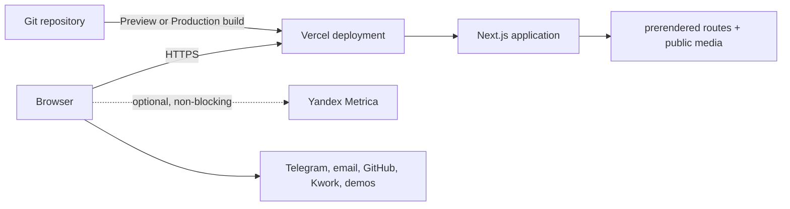

# Architecture Spine — portfolio-website MVP

## Design Paradigm

The product is a **server-first modular monolith with progressive-enhancement islands**. Next.js Server Components render every route's complete semantic narrative; narrow Client Components appear only at the leaves that own interaction, browser APIs, or analytics. Later explicit ADs in this spine override conflicting implementation details in a source document while preserving its product intent.

`app` adapts routes to product modules. `modules` own page capabilities. `content` owns immutable public facts. `shared` owns reusable primitives and pure infrastructure.

## Invariants & Rules

### AD-1 — Essential experience stays server-rendered

- **Binds:** FR-1..FR-17, NFR-2..NFR-4
- **Prevents:** pages whose content, navigation, contact paths, or metadata disappear when hydration or enhancement code fails
- **Rule:** Route composition and all essential copy, links, headings, media alternatives, and metadata are Server Components or framework metadata files. The route compositor owns the sole `h1`; module sections begin at `h2` and preserve source order. A Client Component must be a leaf with a documented browser-only responsibility; it may enhance but never gate reading, navigation, or contact. The server-rendered header exposes one canonical link collection until the menu island marks itself ready. The header owns a fixed `48rem` viewport boundary: at or above it the canonical navigation remains visible and active; below it a ready island makes that navigation `hidden` and `inert` before enabling the trigger/Sheet. Resizing across the boundary closes the Sheet and restores the canonical navigation before disabling its trigger; failed or absent enhancement never sets ready, so the links remain visible and may wrap without horizontal overflow. The Sheet traps focus, closes on Escape, restores trigger focus and page scroll, and preserves sticky-header anchor visibility.

### AD-2 — Dependencies follow product ownership

- **Binds:** all source units
- **Prevents:** page concerns leaking into generic components, circular ownership, and cross-module coupling
- **Rule:** Dependencies flow `app -> modules -> content/shared`; `app` may also read `content` and `shared`. `content/site-shared.ts` owns site-wide copy and destinations, `content/home.ts`, `content/case-study.ts`, and `content/system.ts` own their respective page copy, `content/projects.ts` owns the ordered project collection and its lookups, and `content/define.ts` owns the small reusable project contract. Server modules import only the immutable records they use; route adapters use the same collection for static params and metadata. `shared` imports no route, module, or content record, so shared primitives receive labels through props. Modules never import other modules. A client island stays beside its owning module until at least two modules require the same behavioral contract.



### AD-3 — Typed content contracts own public truth

- **Binds:** FR-2, FR-6..FR-9, FR-12, FR-16, FR-17
- **Prevents:** approved copy, Home, case pages, metadata, sitemap, analytics, and next-project navigation disagreeing
- **Rule:** The typed records under `content/` are the editorial approval authority and executable source consumed by routes and modules; `docs/CONTENT.md` maps these surfaces without duplicating their copy. Components contain structure, not approved visitor-facing strings. Metadata descriptions are separately approved fields, never body-copy truncations. Home order is header, hero, projects, services with a nested three-step process, about, capabilities, final CTA/footer. Case Study order is back/index, opening facts/actions, representative media, one compact project story, ordered gallery, next-project/contact. Visual layout never changes DOM order. Each Case Study requires role, a story covering the challenge, solution, defining capabilities and technical decisions, stack, 4–6 ordered proof assets, demo, repository, contact CTA, metadata, and next-project navigation. The single ordered `projects` array drives Home cards, `generateStaticParams`, sitemap, lookup, and next-project navigation; `dynamicParams` is false and unknown slugs call `notFound()`. Navigable HTML routes are exactly `/`, `/projects/weather-app`, and `/projects/sound-engineer`; metadata endpoints and static/framework assets are separate route classes. One `app/_lib/metadata.ts` mapper combines approved SEO fields with a route-derived path, fixed `ru_RU` locale and index policy. Open Graph media remains optional in local/test/preview builds while final assets are outstanding and is required by the release gate.

### AD-4 — Content is build-owned, not runtime data

- **Binds:** all public content and routes
- **Prevents:** database, CMS, migration, secret, and request-time failure modes without a product requirement
- **Rule:** MVP content lives in repository-owned TypeScript records and is validated before `next build`. All three public routes are statically rendered during the build. No database, runtime content fetch, Server Action, API mutation, ISR, or request-time rendering is permitted.

### AD-5 — Client state has one local owner

- **Binds:** navigation menu, pointer enhancement, approved motion, and any later media viewer
- **Prevents:** competing state owners, broad hydration, and hidden cross-island synchronization
- **Rule:** Each client island owns only its ephemeral UI state. Navigation state belongs to the URL or browser platform. Immutable content remains server-owned. No global client store or cross-island event bus is introduced in the MVP.

### AD-6 — Progressive enhancement is an acceptance boundary

- **Binds:** NFR-1..NFR-4, FR-13..FR-15
- **Prevents:** accessibility, responsive behavior, or performance becoming per-component interpretation
- **Rule:** Every module works at 320px+, with keyboard and touch, visible focus, semantic landmarks, one non-skipping heading hierarchy, Russian document metadata, and operating-system Reduced Motion. Interactive targets are at least 24×24 CSS px; primary touch actions prefer 44×44. Motion may explain state or provide feedback only; no scroll capture, infinite animation, layout-property animation, `transition: all`, or essential hover-only information. The newer static-MVP decision supersedes the source design's interactive four-state 3D renderer: one static SVG/image/CSS composition retains the assembly/repair metaphor, changes no state, and ships no WebGL or 3D dependency.

### AD-7 — Media dimensions are derived; meaning stays with usage

- **Binds:** FR-2, FR-5, FR-9, NFR-2, NFR-3
- **Prevents:** broken public paths, manual technical metadata, layout shift, duplicate assets, and media whose alternative text or caption drifts from its use
- **Rule:** Repository-owned media lives under `public/media` and is statically imported beside the project or site record that gives it meaning. A gallery item owns one `StaticImageData` source, Russian `alt`, and decision/interaction-focused caption; no parallel media ID, path registry, declared dimensions, byte count, MIME field, or stored hash exists. Next.js static imports provide verified intrinsic dimensions to `next/image` and make missing or undecodable references fail the build. Each project supplies 4–6 ordered, non-placeholder production assets covering desktop, mobile, and a defining interaction. A portrait uses one adaptable source when its crop works at every breakpoint; separate crops are introduced only when art direction requires them. `scripts/check-media.ts` independently scans real files for allowed formats, decodability, intrinsic dimensions, per-file budgets, aggregate payload, and byte-identical duplicates. Duplicate content warns during local work and blocks `BUILD_PROFILE=release`. Raster sources above 750 KiB, SVG sources above 100 KiB, Open Graph files prefixed `og-` above 400 KiB, or an aggregate `public/media` payload above 6 MiB block the build. Card frames and Case Study media own distinct presentation ratios.

### AD-8 — Analytics cannot own navigation

- **Binds:** FR-10..FR-12
- **Prevents:** vendor calls scattered through modules, divergent event names, and blocked analytics breaking conversion paths
- **Rule:** Every explicitly tracked destination uses the shared `TrackedLink` client leaf. It renders a native anchor, accepts a discriminated vendor-neutral event, calls only `analytics.track(event)` without preventing or delaying navigation, and becomes an ordinary link when analytics is absent or blocked. One event is emitted for each trusted, non-prevented native activation: `click` with button 0 (including keyboard and Ctrl/Cmd/Shift/Alt modified activation) or `auxclick` with button 1. Right-click/context-menu, untrusted synthetic replay, hover, focus, and unlisted same-document anchors emit nothing. A keyboard activation produces its single browser `click`; no separate key handler exists. Repeated activations, including the two clicks of a double-click, remain distinct; there is no time-based deduplication, retry, or navigation wait. The event union covers hero/footer/Case Study Telegram placement, email, Kwork, GitHub profile, per-project demo/repository, Home project entry, all-projects return, and next-project navigation; project identity is a `ProjectSlug` payload, while the analytics facade alone maps events to Yandex goals and invokes `ym`. The root initializes Metrica with `defer: true`; `RouteViewTracker` calls only `analytics.pageView(pathname + search, previousUrl)`, emitting exactly one initial hit and one hit per effective App Router change while suppressing duplicates. Hashes are excluded. No module or component reads the vendor global.

### AD-9 — Native HTML and CSS are the default UI substrate

- **Binds:** all modules and shared UI
- **Prevents:** unnecessary client bundles, competing primitive libraries, and styling that diverges from the approved design system
- **Rule:** Root global styles own semantic color, typography, spacing, radius, focus, and motion tokens plus one Reduced Motion policy; modules and copied primitives consume them. The root loads the Cyrillic and Latin subsets of Geist Sans/Mono through `next/font/google`; Next.js self-hosts the resulting assets with stable fallbacks and non-blocking display. Use semantic HTML and explicit Tailwind/CSS transitions first. Enhanced navigation must meet the Sheet behavior contract; a shipped media viewer must meet Dialog-equivalent Escape, focus-containment/return, centered transform-origin, and browser-zoom contracts. External links expose destination type and announce new-tab behavior. Add Motion only when runtime input, a spring, or coordinated interruptible choreography cannot be expressed cleanly with CSS or WAAPI. No dependency is installed speculatively.

### AD-10 — Build-time configuration has a single owner

- **Binds:** FR-12, FR-16, FR-17, production deployment
- **Prevents:** localhost metadata, inconsistent domains, duplicated proxy/app settings, and untracked public configuration
- **Rule:** One strict parser in `shared/config/build.ts` runs before `next.config.ts` returns. An explicit `BUILD_PROFILE` accepts exactly `local`, `test`, `preview`, or `release` with no trimming or case folding. Without an override, Vercel's `VERCEL_ENV` maps `development` to `local`, `preview` to `preview`, and `production` to `release`; absence outside Vercel means `local`. `local` fixes the origin to `http://localhost:3000`, `test` to `http://127.0.0.1:3000`, and both reject a Metrica ID. Preview and release metadata use the stable production hostname from `VERCEL_PROJECT_PRODUCTION_URL`; a normalized `SITE_URL` remains an explicit local release-rehearsal override. Preview rejects a Metrica ID, while release requires `YANDEX_METRICA_ID` to match `^[1-9][0-9]*$`. The parser serializes only the validated production origin and public counter ID into browser-visible build constants. One URL builder emits lowercase-host, no-trailing-slash canonical/sitemap URLs without query or fragment; preview deployments therefore never publish preview-domain canonicals. Next.js owns metadata, CSP, security headers, external-domain allowlists, and slashless path normalization. Vercel owns deployment environment, public HTTPS, CDN delivery, platform routing, and rollback. A setting has one owner.

### AD-11 — Vercel owns immutable deployments

- **Binds:** production runtime and release operations
- **Prevents:** environment-specific rebuild scripts, preview domains leaking into canonical metadata, mutable host state, and unreproducible rollback
- **Rule:** Vercel's Git integration builds the Next.js project with the repository-pinned dependencies and Node.js 24. Every non-production branch receives an isolated Preview deployment; the configured production branch creates Production deployments. The standard `npm run build` runs the repository validation gate before `next build`, so Vercel cannot create a deployment from code that fails formatting, lint, type, unit, content, or media checks. Public pages remain statically generated and Vercel serves their framework and media assets through its managed delivery layer. A deployment is immutable and tied to one Git commit; rollback promotes or redeploys a previously verified Vercel deployment rather than rebuilding mutable server state. The application exposes no custom health endpoint because platform availability and deployment status belong to Vercel.

### AD-12 — Release evidence precedes deployment

- **Binds:** all routes and NFR-1..NFR-5
- **Prevents:** responsive, browser, accessibility, content, and enhancement regressions depending on developer memory
- **Rule:** The Vercel Build Command is the repository-standard `npm run build`; it runs formatting check, ESLint, TypeScript, unit tests, content/media validation, and the Next.js production build. Preview deployment acceptance then runs Playwright against the exact immutable Preview URL before promotion to Production. Chromium covers all routes at 375, 768, 1024, and 1440px; Firefox and WebKit cover critical navigation/contact paths. The gate proves navigable routes, localized 404 recovery, exact-once analytics calls and release debug events, no horizontal overflow, 200% text zoom, 400% reflow, keyboard/focus visibility, touch/coarse pointer, Reduced Motion, unavailable non-critical JavaScript, slow network, media roles, external destinations, and zero axe critical/serious violations. Version-controlled lab settings run every route three cold-cache times at 375×812, 4× CPU, 150ms RTT, 1.6Mbps down/750Kbps up; median LCP ≤2.5s, CLS ≤0.1, and scripted primary-interaction latency ≤200ms block production promotion. Manual current Edge/Safari/mobile Chrome/mobile Safari, screen-reader, motion, messaging-thumbnail, and real-device checks complete the gate.

## Consistency Conventions

| Concern       | Convention                                                                                                                                                                                                                                                                                                                                           |
| ------------- | ---------------------------------------------------------------------------------------------------------------------------------------------------------------------------------------------------------------------------------------------------------------------------------------------------------------------------------------------------- |
| Naming        | Route and content slugs are lower kebab-case; React components are PascalCase; module folders name product areas; analytics keys use `<surface>_<destination>` from a closed union.                                                                                                                                                                  |
| Content       | Typed records under `content/` are the approval authority; `docs/CONTENT.md` maps them without duplicating copy. Commercial facts, contact destinations, required evidence, and negative-claim constraints are data, never component literals.                                                                                                       |
| Links         | Internal navigation uses `next/link`; tracked internal destinations compose it through `TrackedLink`. External HTTPS destinations open in a new tab with visible/assistive destination signaling and `rel="noopener noreferrer"`; `mailto:` keeps native same-context handling. Destination URLs come from content/config, never component literals. |
| Media         | Files live under `public/media` and are statically imported beside contextual alt/caption copy; Next.js derives dimensions and `check-media.ts` enforces file budgets and integrity.                                                                                                                                                                 |
| State         | Server data is immutable; client state is local and ephemeral; the URL owns navigation state; analytics is fire-and-forget.                                                                                                                                                                                                                          |
| Failure       | Invalid content/config fails the build. Optional analytics and interaction enhancement fail open to semantic HTML. Dead external links and development media placeholders block release rather than producing production error UI.                                                                                                                   |
| Configuration | Vercel system variables select Preview/Production automatically; both use the production canonical origin, while analytics is enabled only for Production.                                                                                                                                                                                           |
| Observability | Vercel deployment/build logs and Yandex Metrica are the MVP operational record. Preview acceptance verifies rendered routes and representative framework/media assets before production promotion.                                                                                                                                                   |

## Stack

Reviewed implementation baseline:

| Name                   | Version | State                            |
| ---------------------- | ------- | -------------------------------- |
| Node.js                | 24.x    | Vercel runtime family            |
| Next.js                | 16.2.11 | locked                           |
| PostCSS                | 8.5.22  | security override, exact-locked  |
| sharp                  | 0.35.3  | security override, exact-locked  |
| React                  | 19.2.4  | locked                           |
| React DOM              | 19.2.4  | locked                           |
| TypeScript             | 5.9.3   | locked                           |
| Tailwind CSS           | 4.3.3   | locked                           |
| ESLint                 | 9.39.5  | locked                           |
| Prettier               | 3.9.6   | locked                           |
| `@playwright/test`     | 1.61.1  | required, then exact-lock        |
| `@axe-core/playwright` | 4.12.1  | required, then exact-lock        |
| Vercel                 | managed | deployment and delivery platform |

Every planned row is installed and exact-locked before its gate runs. All rows receive a patch/security review before first release; upgrades pass the full gate rather than following `latest` automatically.

## Structural Seed

```text
src/
  app/                         # routes, metadata, sitemap, robots, composition
    _lib/metadata.ts           # sole Next page metadata/OG mapper
    projects/[slug]/           # registry-backed static Case Study route
  modules/
    home/                      # Home page: widgets plus module-only UI/islands
    case-study/                # Case Study page: widgets plus module-only UI/islands
  content/
    define.ts                  # small project/content contracts and assertions
    site.ts                    # approved site, Home, UI and system copy
    projects.ts                # approved ordered project records and lookups
  shared/
    analytics/                 # root-level analytics React leaves
    config/build.ts            # sole strict build-profile/environment parser
    lib/analytics/             # vendor adapter and event contract
    lib/url/                   # canonical and analytics URL normalization
    ui/                        # reusable visual/behavioral primitives
    widgets/                   # reusable composed interface blocks
public/
  media/                       # portrait, project, and social assets
scripts/
  check-media.ts               # file integrity and byte-budget validation
tests/
  e2e/                         # cross-route acceptance checks
  performance/                 # versioned lab profile and raw evidence
```



## Capability → Architecture Map

| Capability / Area                               | Lives in                                                           | Governed by              |
| ----------------------------------------------- | ------------------------------------------------------------------ | ------------------------ |
| Home narrative, services, process, about        | `modules/home`, `content`                                          | AD-1, AD-2, AD-3, AD-6   |
| Project discovery and two Case Studies          | `content/projects.ts`, `modules/case-study`, `app/projects/[slug]` | AD-2, AD-3, AD-4, AD-7   |
| Contact and external destinations               | `shared/ui/TrackedLink`, `shared/analytics`, `shared/lib/analytics`, `content` | AD-1, AD-8               |
| Motion and system-object identity               | owning module islands and static media                             | AD-1, AD-6, AD-9         |
| SEO, Open Graph, sitemap, robots, localized 404 | `app`, site/project records, site config                           | AD-3, AD-4, AD-10, AD-12 |
| Responsive, accessible, resilient experience    | modules, shared UI, e2e gate                                       | AD-1, AD-6, AD-7, AD-12  |
| Vercel Preview and Production delivery          | Vercel project settings, `package.json`, build config              | AD-10, AD-11, AD-12      |

## Deferred

- **Interactive 3D:** reconsider only after the static release meets Core Web Vitals and accessibility criteria and a device-tested prototype proves narrative value; any renderer remains a lazy replaceable island behind the static fallback.
- **Motion dependency:** add and pin only when an approved interaction proves CSS/WAAPI insufficient.
- **CMS, JSON source, or database:** reconsider when non-developers must publish independently or content frequency outgrows code review; validate any external data at the content boundary.
- **Additional CI orchestration:** reconsider when Preview acceptance must run without manual promotion; preserve the same repository build gate and immutable-deployment rollback contract.
- **External error tracking:** reconsider after production incidents show Vercel deployment/function logs and browser acceptance tests are insufficient; do not add a client tracker speculatively.
- **CSP source expansion:** update the application-owned allowlist only when an approved external dependency requires a new origin.
- **Source-document alignment:** update the UX/design documents' interactive four-state 3D language at their next revision; AD-6 is authoritative for implementation until then.
- **Field Core Web Vitals source:** after 30 days and once a statistically useful sample exists, select a field source, review p75 LCP/INP/CLS against 2.5s/200ms/0.1, and create corrective work for misses; the versioned lab gate remains release-blocking meanwhile.
- **Media viewer:** not required for the first release; galleries remain readable and zoomable without it. If later adopted, the AD-9 Dialog behavior becomes mandatory.
