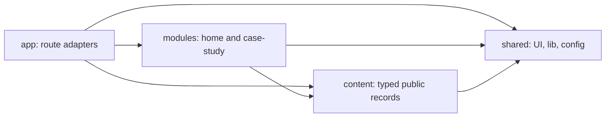
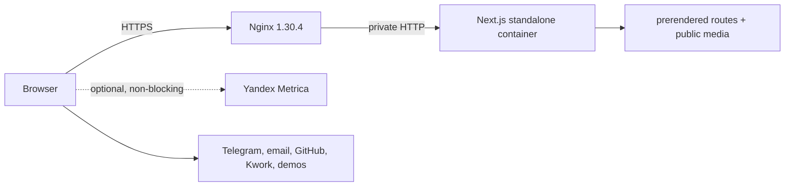

# Architecture Spine — portfolio-website MVP

## Design Paradigm

The product is a **server-first modular monolith with progressive-enhancement islands**. Next.js Server Components render every route's complete semantic narrative; narrow Client Components appear only at the leaves that own interaction, browser APIs, or analytics. Later explicit ADs in this spine override conflicting implementation details in a source document while preserving its product intent.

`app` adapts routes to product modules. `modules` own page capabilities. `content` owns immutable public facts. `shared` owns reusable primitives and pure infrastructure.

## Invariants & Rules

### AD-1 — Essential experience stays server-rendered

- **Binds:** FR-1..FR-17, NFR-2..NFR-4
- **Prevents:** pages whose content, navigation, contact paths, or metadata disappear when hydration or enhancement code fails
- **Rule:** Route composition and all essential copy, links, headings, media alternatives, and metadata are Server Components or framework metadata files. The route compositor owns the sole `h1`; module sections begin at `h2` and preserve source order. A Client Component must be a leaf with a documented browser-only responsibility; it may enhance but never gate reading, navigation, or contact. The server-rendered header exposes one canonical link collection until the menu island marks itself ready. The header owns a fixed `48rem` viewport boundary: at or above it the canonical navigation remains visible and active; below it a ready island makes that navigation `hidden` and `inert` before enabling the trigger/Sheet. Resizing across the boundary closes the Sheet and restores the canonical navigation before disabling its trigger; failed or absent enhancement never sets ready, so the links remain visible and may wrap without horizontal overflow. The Sheet traps focus, closes on Escape, restores trigger focus and page scroll, and preserves sticky-header anchor visibility.

### AD-2 — Dependencies follow product ownership

- **Binds:** all source units
- **Prevents:** page concerns leaking into generic components, circular ownership, and cross-module coupling
- **Rule:** Dependencies flow `app -> modules -> content/shared`; `app` may also read `content` and `shared`. `content/contracts.ts` owns canonical record/render-model types and `content/selectors.ts` alone owns registry lookup and cross-surface projections. Route adapters resolve params and pass readonly render models into modules; modules may import content contract types but not registries or selectors. `shared` imports no route, module, or content record. Modules never import other modules. A client island stays beside its owning module until at least two modules require the same behavioral contract.



### AD-3 — Typed content contracts own public truth

- **Binds:** FR-2, FR-6..FR-9, FR-12, FR-16, FR-17
- **Prevents:** approved copy, Home, case pages, metadata, sitemap, analytics, and next-project navigation disagreeing
- **Rule:** `docs/CONTENT.md` is the editorial approval authority; readonly TypeScript site, Home, contact, service, and project records are its executable projection and change with it in the same reviewed change. Prose uses readonly ordered paragraph blocks whose inline tokens are a closed `text | emphasis | link` union; arbitrary HTML and Markdown-at-runtime are forbidden. Projection preserves approved words, punctuation, emphasis, link labels/targets, and paragraph boundaries exactly after only CRLF-to-LF and Unicode-NFC normalization; it performs no smart-punctuation, whitespace, or case rewriting. Metadata descriptions are separately approved fields, never body-copy truncations. Any other textual or structural change requires editorial reapproval and a validator snapshot update. Home order is header, hero, projects, services, process, about, capabilities, final CTA/footer. Case Study order is back/index, opening facts/actions, representative media, challenge, solution/features, technical decisions/stack, ordered gallery, next-project/contact. Visual layout never changes DOM order. Each Case Study requires role, task, solution, features, technical decisions, stack, 4–6 ordered proof assets, demo, repository, contact CTA, metadata, and next-project navigation. The project registry drives `generateStaticParams`; `dynamicParams` is false and unknown slugs call `notFound()`. Navigable HTML routes are exactly `/`, `/projects/weather-app`, and `/projects/sound-engineer`; metadata endpoints, static/framework assets, and the private health endpoint are separate route classes. One `app/_lib/metadata.ts` mapper consumes selector-produced metadata models for page metadata, canonical/alternate URLs, Open Graph, sitemap, and robots. Its required schema is title, description, canonical path, `ru_RU` locale, index policy, and an Open Graph image with URL, dimensions, and Russian alt; missing values fail validation, with no implicit fallback. The localized static not-found page is non-indexable and never receives project metadata.

### AD-4 — Content is build-owned, not runtime data

- **Binds:** all public content and routes
- **Prevents:** database, CMS, migration, secret, and request-time failure modes without a product requirement
- **Rule:** MVP content lives in repository-owned TypeScript records and is validated before `next build`. All three public routes are statically rendered during the build. No database, runtime content fetch, Server Action, API mutation, ISR, or request-time rendering is permitted.

### AD-5 — Client state has one local owner

- **Binds:** navigation menu, pointer enhancement, approved motion, and any later media viewer
- **Prevents:** competing state owners, broad hydration, and hidden cross-island synchronization
- **Rule:** Each client island owns only its ephemeral UI state. Navigation state belongs to the URL or browser platform. Immutable content remains server-owned. No global client store or cross-island event bus is introduced in the MVP.

### AD-6 — Progressive enhancement is an acceptance boundary

- **Binds:** NFR-1..NFR-4, FR-13..FR-15
- **Prevents:** accessibility, responsive behavior, or performance becoming per-component interpretation
- **Rule:** Every module works at 320px+, with keyboard and touch, visible focus, semantic landmarks, one non-skipping heading hierarchy, Russian document metadata, and operating-system Reduced Motion. Interactive targets are at least 24×24 CSS px; primary touch actions prefer 44×44. Motion may explain state or provide feedback only; no scroll capture, infinite animation, layout-property animation, `transition: all`, or essential hover-only information. The newer static-MVP decision supersedes the source design's interactive four-state 3D renderer: one static SVG/image/CSS composition retains the assembly/repair metaphor, changes no state, and ships no WebGL or 3D dependency.

### AD-7 — Media dimensions and meaning are manifest data

- **Binds:** FR-2, FR-5, FR-9, NFR-2, NFR-3
- **Prevents:** broken public paths, layout shift, and media whose alternative text or caption drifts from its purpose
- **Rule:** Repository-owned media lives under `public/` and is referenced by stable media IDs. Asset records own path, MIME/format, byte identity, and actual intrinsic dimensions; contextual usage records own Russian `alt`, decision/interaction-focused `caption`, `purpose`, and proof role. Each project supplies 4–6 ordered, non-placeholder production assets covering desktop, mobile, and a defining interaction; portrait records include desktop and mobile crops. The validator checks case-sensitive paths, uniqueness, allowed formats, decodability, corruption, and actual dimensions/aspect ratio against declarations. It also blocks raster sources above 750 KiB, SVG sources above 100 KiB, Open Graph images above 400 KiB, or an aggregate `public/media` payload above 6 MiB; the mobile-profile LCP image response must remain at or below 200 KiB. Card frames and Case Study media own distinct presentation ratios.

### AD-8 — Analytics cannot own navigation

- **Binds:** FR-10..FR-12
- **Prevents:** vendor calls scattered through modules, divergent event names, and blocked analytics breaking conversion paths
- **Rule:** Every explicitly tracked destination uses the shared `TrackedLink` client leaf. It renders a native anchor, accepts a discriminated vendor-neutral event, calls only `analytics.track(event)` without preventing or delaying navigation, and becomes an ordinary link when analytics is absent or blocked. One event is emitted for each trusted, non-prevented native activation: `click` with button 0 (including keyboard and Ctrl/Cmd/Shift/Alt modified activation) or `auxclick` with button 1. Right-click/context-menu, untrusted synthetic replay, hover, focus, and unlisted same-document anchors emit nothing. A keyboard activation produces its single browser `click`; no separate key handler exists. Repeated activations, including the two clicks of a double-click, remain distinct; there is no time-based deduplication, retry, or navigation wait. The event union covers hero/footer/Case Study Telegram placement, email, Kwork, GitHub profile, per-project demo/repository, Home project entry, all-projects return, and next-project navigation; project identity is a `ProjectSlug` payload, while the analytics facade alone maps events to Yandex goals and invokes `ym`. The root initializes Metrica with `defer: true`; `RouteViewTracker` calls only `analytics.pageView(pathname + search, previousUrl)`, emitting exactly one initial hit and one hit per effective App Router change while suppressing duplicates. Hashes are excluded. No module or component reads the vendor global.

### AD-9 — Native HTML and CSS are the default UI substrate

- **Binds:** all modules and shared UI
- **Prevents:** unnecessary client bundles, competing primitive libraries, and styling that diverges from the approved design system
- **Rule:** Root global styles own semantic color, typography, spacing, radius, focus, and motion tokens plus one Reduced Motion policy; modules and copied primitives consume them. The root loads the official full-glyph Geist package for Cyrillic Sans/Mono with stable fallbacks and non-blocking display. Use semantic HTML and explicit Tailwind/CSS transitions first. Enhanced navigation must meet the Sheet behavior contract; a shipped media viewer must meet Dialog-equivalent Escape, focus-containment/return, centered transform-origin, and browser-zoom contracts. External links expose destination type and announce new-tab behavior. Add Motion only when runtime input, a spring, or coordinated interruptible choreography cannot be expressed cleanly with CSS or WAAPI. No dependency is installed speculatively.

### AD-10 — Build-time configuration has a single owner

- **Binds:** FR-12, FR-16, FR-17, production deployment
- **Prevents:** localhost metadata, inconsistent domains, duplicated proxy/app settings, and untracked public configuration
- **Rule:** One strict parser in `shared/config/build.ts` runs before `next.config.ts` returns. `BUILD_PROFILE` accepts exactly `local`, `test`, or `release` with no trimming or case folding; absence means `local` only outside the production Docker build. `local` fixes the origin to `http://localhost:3000`, `test` to `http://127.0.0.1:3000`, and both reject a Metrica ID. `release` requires `SITE_URL` to equal one normalized HTTPS origin with lowercase host and no credentials, port, path, trailing slash, query, or fragment, and requires `YANDEX_METRICA_ID` to match `^[1-9][0-9]*$`; leading/trailing whitespace is invalid. The parser serializes only that origin and public counter ID into browser-visible build constants; other environment values remain server-only. One URL builder emits lowercase-host, no-trailing-slash canonical/sitemap URLs without query or fragment; analytics paths use pathname plus search and no hash. The release configuration is the single owner of the canonical origin: it supplies application metadata and templates Nginx `server_name`. Nginx issues 308 redirects from HTTP and any configured alternate host to that HTTPS origin while preserving path/query; Next.js `trailingSlash: false` normalizes incoming page paths to the slashless form. Configuration is validated and baked into the immutable image, not changed silently at runtime. The application owns metadata, CSP, and external-domain allowlists; Docker owns runtime and health; Nginx owns public HTTP(S), TLS/HSTS, request limits, and reverse proxy. A setting has one owner.

### AD-11 — Production runs one immutable standalone artifact

- **Binds:** production runtime and release operations
- **Prevents:** host-dependent builds, exposed Node ports, per-instance cache divergence, and unreproducible rollback
- **Rule:** A multi-stage Docker build produces Next.js `output: "standalone"` on Node.js 24 LTS, copies `public/` to `.next/standalone/public` and `.next/static` to `.next/standalone/.next/static`, and starts `node server.js`. Compose has `proxy` and `app` services on a private network; only Nginx publishes 80/443. The private `/healthz` response includes the source commit build ID. Manual release starts from a clean commit after the full gate, builds for the inventoried VPS platform, saves the exact image, records its tarball SHA-256, transfers and verifies it on the VPS, loads it, and deploys Compose pinned to the commit tag. Building from a VPS checkout is prohibited. Smoke evidence covers the three HTML routes, one framework asset, one media asset, and one optimized-image response; rollback redeploys the prior verified artifact.

### AD-12 — Release evidence precedes deployment

- **Binds:** all routes and NFR-1..NFR-5
- **Prevents:** responsive, browser, accessibility, content, and enhancement regressions depending on developer memory
- **Rule:** Before building the production image, run formatting check, ESLint, content/media validation, Next.js build, and Playwright against the production build. Playwright runs in the official image matching the exact package version and a pinned digest; browser revisions and reports are release evidence. Chromium covers all routes at 375, 768, 1024, and 1440px; Firefox and WebKit cover critical navigation/contact paths. The gate proves navigable routes, localized 404 recovery, exact-once analytics calls and release debug events, no horizontal overflow, 200% text zoom, 400% reflow, keyboard/focus visibility, touch/coarse pointer, Reduced Motion, unavailable non-critical JavaScript, slow network, media roles, external destinations, and zero axe critical/serious violations. Version-controlled lab settings run every route three cold-cache times at 375×812, 4× CPU, 150ms RTT, 1.6Mbps down/750Kbps up; median LCP ≤2.5s, CLS ≤0.1, and scripted primary-interaction latency ≤200ms block release. Manual current Edge/Safari/mobile Chrome/mobile Safari, screen-reader, motion, messaging-thumbnail, and real-device checks complete the gate.

## Consistency Conventions

| Concern | Convention |
| --- | --- |
| Naming | Route and content slugs are lower kebab-case; React components are PascalCase; module folders name product areas; analytics keys use `<surface>_<destination>` from a closed union. |
| Content | `docs/CONTENT.md` is the approval authority; readonly TypeScript projections contain no JSX or vendor calls and change in the same review. Commercial facts, contact destinations, required evidence, and negative-claim constraints are validated data, never component literals. |
| Links | Internal navigation uses `next/link`; tracked internal destinations compose it through `TrackedLink`. External HTTPS destinations open in a new tab with visible/assistive destination signaling and `rel="noopener noreferrer"`; `mailto:` keeps native same-context handling. Destination URLs come from content/config, never component literals. |
| Media | Public URLs begin with `/media/`; asset records own file facts and usage records own contextual meaning; `next/image` reserves verified dimensions and below-fold assets are lazy by default. |
| State | Server data is immutable; client state is local and ephemeral; the URL owns navigation state; analytics is fire-and-forget. |
| Failure | Invalid content/config fails the build. Optional analytics and interaction enhancement fail open to semantic HTML. Dead external links and development media placeholders block release rather than producing production error UI. |
| Configuration | `BUILD_PROFILE=release` validates and bakes public production configuration at image build; local/test analytics is disabled; no public value is duplicated in Nginx and application config. |
| Observability | Nginx access/error logs and container stdout/stderr are the MVP operational record. The internal health check verifies `/healthz` status and build ID; the release smoke check verifies the rendered Home route and representative framework/media assets. |

## Stack

Reviewed implementation baseline:

| Name | Version | State |
| --- | --- | --- |
| Node.js | 24.18.0 LTS | planned Docker runtime |
| Next.js | 16.2.11 | locked |
| React | 19.2.4 | locked |
| React DOM | 19.2.4 | locked |
| TypeScript | 5.9.3 | locked |
| Tailwind CSS | 4.3.3 | locked |
| `geist` | 1.7.2 | required, then exact-lock |
| ESLint | 9.39.5 | locked |
| Prettier | 3.9.6 | locked |
| `@playwright/test` | 1.61.1 | required, then exact-lock |
| `@axe-core/playwright` | 4.12.1 | required, then exact-lock |
| Nginx | 1.30.4 stable | planned proxy image |

Every planned row is installed and exact-locked before its gate runs. All rows receive a patch/security review before first release; upgrades pass the full gate rather than following `latest` automatically.

## Structural Seed

```text
src/
  app/                         # routes, metadata, sitemap, robots, composition
    _lib/metadata.ts           # sole Next metadata/OG/sitemap projection mapper
    healthz/route.ts           # private status and source commit build ID
    projects/[slug]/           # registry-backed static Case Study route
  modules/
    home/                      # Home sections and owned islands
    case-study/                # shared Case Study renderer and owned islands
  content/
    contracts.ts               # canonical content and render-model types
    selectors.ts               # registry lookup and cross-surface projections
    site.ts                    # Home metadata, navigation, contact, service copy
    home.ts                    # fixed Home section content projection
    projects/                  # approved per-project records
    registry.ts                # ordered project source of truth
    media.ts                   # asset and contextual-usage contracts
  shared/
    config/build.ts            # sole strict build-profile/environment parser
    lib/analytics/             # vendor adapter and event contract
    lib/url/                   # canonical and analytics URL normalization
    ui/                        # proven shared primitives
public/
  media/                       # portrait, project, and social assets
scripts/
  validate-content-media.*     # build-boundary validation
tests/
  e2e/                         # cross-route acceptance checks
  performance/                 # versioned lab profile and raw evidence
deploy/
  nginx/                       # proxy and transport policy
Dockerfile
compose.yaml
```



## Capability → Architecture Map

| Capability / Area | Lives in | Governed by |
| --- | --- | --- |
| Home narrative, services, process, about | `modules/home`, `content` | AD-1, AD-2, AD-3, AD-6 |
| Project discovery and two Case Studies | `content/projects`, `content/registry.ts`, `modules/case-study`, `app/projects/[slug]` | AD-2, AD-3, AD-4, AD-7 |
| Contact and external destinations | `shared/ui/TrackedLink`, `shared/lib/analytics`, `content` | AD-1, AD-8 |
| Motion and system-object identity | owning module islands and static media | AD-1, AD-6, AD-9 |
| SEO, Open Graph, sitemap, robots, localized 404 | `app`, site/project records, site config | AD-3, AD-4, AD-10, AD-12 |
| Responsive, accessible, resilient experience | modules, shared UI, e2e gate | AD-1, AD-6, AD-7, AD-12 |
| VPS production delivery | Dockerfile, Compose, Nginx config | AD-10, AD-11, AD-12 |

## Deferred

- **Canonical domain, final media, and Yandex Metrica ID:** required `BUILD_PROFILE=release` inputs before production release; they do not change module boundaries.
- **Interactive 3D:** reconsider only after the static release meets Core Web Vitals and accessibility criteria and a device-tested prototype proves narrative value; any renderer remains a lazy replaceable island behind the static fallback.
- **Motion dependency:** add and pin only when an approved interaction proves CSS/WAAPI insufficient.
- **CMS, JSON source, or database:** reconsider when non-developers must publish independently or content frequency outgrows code review; validate any external data at the content boundary.
- **CI/CD:** reconsider when a remote repository/registry is selected or deployments become regular; preserve the same quality gate, commit-tagged image, manual production approval, and rollback contract.
- **CDN, multiple app instances, and shared cache:** reconsider only when measured traffic or availability needs exceed one VPS instance.
- **External error tracking:** reconsider after production incidents show Nginx/container logs and browser acceptance tests are insufficient; do not add a client tracker speculatively.
- **Exact Docker Engine/Compose versions and image digests:** record from the target VPS and pin before the first deployment.
- **Final CSP source allowlist:** close after the canonical domain, Yandex Metrica integration, and all external media/script origins are known; production ships no report-only placeholder policy.
- **Source-document alignment:** update the UX/design documents' interactive four-state 3D language at their next revision; AD-6 is authoritative for implementation until then.
- **Field Core Web Vitals source:** after 30 days and once a statistically useful sample exists, select a field source, review p75 LCP/INP/CLS against 2.5s/200ms/0.1, and create corrective work for misses; the versioned lab gate remains release-blocking meanwhile.
- **Media viewer:** not required for the first release; galleries remain readable and zoomable without it. If later adopted, the AD-9 Dialog behavior becomes mandatory.
